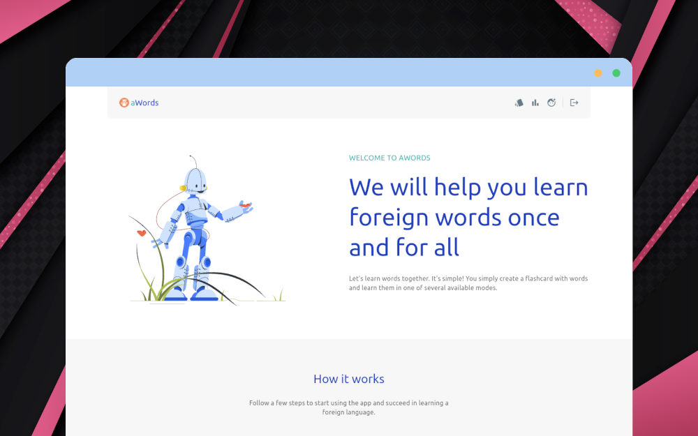

aWords
===================

An experimental project on Dart/Flutter that implements one entire application ecosystem. 
The project is in development, I’m not sure it will be finished - it’s not a rewarding task to write websites and APIs in Dart/Flutter;
there are more convenient tools.

**Used:** [Dart](https://dart.dev/) & [Flutter](https://flutter.dev/)

### Feature

* [API](https://awords-api.keygenqt.com)
* [Website](https://awords.keygenqt.com)
* [Documentation](https://awords-docs.keygenqt.com)

### Preview


# License

```
Copyright 2024 Vitaliy Zarubin

Licensed under the Apache License, Version 2.0 (the "License");
you may not use this file except in compliance with the License.
You may obtain a copy of the License at

    http://www.apache.org/licenses/LICENSE-2.0

Unless required by applicable law or agreed to in writing, software
distributed under the License is distributed on an "AS IS" BASIS,
WITHOUT WARRANTIES OR CONDITIONS OF ANY KIND, either express or implied.
See the License for the specific language governing permissions and
limitations under the License.
```
