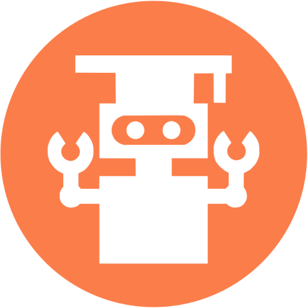

aWords
---

<p>
    
</p>

Leave notes and paper cards at home and learn a foreign language anywhere with aWords.

### Plan

1. Flutter - web, aurora (android, ios).
2. Dictionaries - [FreeDict](https://freedict.org/).
3. API - authorization, registration, statistics, share access to cards and statistics.
4. The ability to create your own list with the words.
5. Sharing your lists with others both privately and publicly.
6. Modes: pictures, native-words, words to learn, by description.
7. The user's progress can be share to users.
8. Children's mode - cute text etc...

### Preview Now


#### It's not native, it's web flutter + qml webview.

### License

```
Copyright 2022-2023 Vitaliy Zarubin

Licensed under the Apache License, Version 2.0 (the "License");
you may not use this file except in compliance with the License.
You may obtain a copy of the License at

    http://www.apache.org/licenses/LICENSE-2.0

Unless required by applicable law or agreed to in writing, software
distributed under the License is distributed on an "AS IS" BASIS,
WITHOUT WARRANTIES OR CONDITIONS OF ANY KIND, either express or implied.
See the License for the specific language governing permissions and
limitations under the License.
```

<div>Icons made by <a href="https://icon54.com/" title="Pixel perfect">Pixel perfect</a> from <a href="https://www.flaticon.com/" title="Flaticon">www.flaticon.com</a></div>
